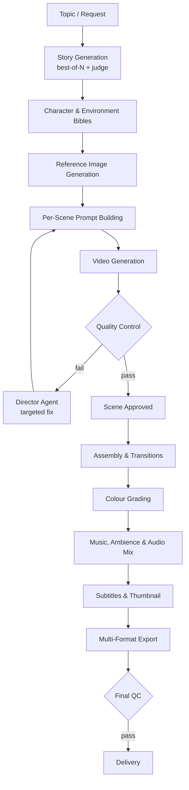

# 🎬 Gemini Video Bot

**Type a story idea. Get back a finished, edited, subtitled video — fully unattended.**

An automated story-to-video pipeline that turns a one-line topic into a complete
short film: script, characters, reference art, per-scene video, quality control,
music, subtitles, thumbnail, and export — with no human in the loop.

> 📦 **This repository is a showcase.** The source code is sold separately —
> see [Get the Source Code](#-get-the-source-code).

---

## What it does

You give it a topic. It does the rest:

```
"Two friends find a lottery ticket"  →  a finished 5-minute film
```

Behind that one line, the pipeline writes a scene-by-scene script, designs a
consistent cast and set of locations, generates reference art for each, produces
a video clip per scene, checks every clip against the references, retries or
repairs the ones that miss, then assembles, grades, scores, subtitles, and
exports the finished movie — and delivers it back to you over Discord.

It is built to run **unattended for days**. Generation is rate-limited by the
underlying providers, so the system is designed around waiting: it survives
restarts, resumes exactly where it left off, waits out quota limits without
burning them, and recovers from failures on its own rather than stopping to ask.

---

## ✨ Key features

### Story & character generation
- **Topic → full script** — generates a scene-wise screenplay from a single line, in your chosen language and target runtime
- **Best-of-N story selection** — generates multiple candidate scripts and picks the strongest via an LLM judge
- **Character bible** — a persistent cast definition (appearance, clothing, height, expressions, personality) reused across every scene
- **Environment bible** — the same treatment for locations, so settings stay consistent
- **Reference image generation** — per-character and per-environment reference art, itself best-of-N and judge-selected

### Quality control that actually gates
- **Vision QC** — extracted frames are compared against the character and environment references, scored for likeness
- **Continuity checking** — the end of each scene is compared against the start of the next for clothing, hairstyle, props, location, and time-of-day drift, while tolerating changes the script deliberately calls for
- **Emotion matching** — verifies the emotion on screen matches what the script asked for
- **Audio QC** — checks for a real audio track, correct duration, silence, and dialogue accuracy via speech-to-text against the expected lines
- **Technical QC** — duration, resolution, corrupt files, and blank or frozen frames
- **Composite quality scoring** — every check rolls into a single 0–100 score that drives approval

### Self-healing, unattended operation
- **Director agent** — turns a specific QC failure into one targeted, concrete instruction for the next attempt, instead of a fixed rule table
- **Best-of-N clip selection** — when no attempt is perfect, the strongest one is chosen automatically rather than blocking
- **Prompt-softening ladder** — progressively simplifies a prompt that keeps failing, then skips the scene and builds the movie around the gap rather than stalling
- **Crash-safe resume** — all progress is tracked in a per-story database; a restart picks up exactly where it stopped, and work caught mid-flight is reset to a safe state instead of trusted
- **Quota-limit handling** — detects provider usage limits, waits them out without submitting more work, and resumes automatically when they reset
- **Emergency stop** — a circuit breaker halts the run when failures look systemic rather than scene-specific
- **Crash-loop protection** — escalating backoff prevents a broken run from hammering the providers

### Post-production
- **Automatic assembly** — joins approved scenes in order into a single film
- **Transitions** — cut, fade, dissolve, zoom, and motion blur, chosen per scene or varied automatically to match the emotional beat
- **Colour grading** — normalises brightness, contrast, saturation, and white balance across scenes so they don't look shot on different cameras
- **Audio mixing** — dialogue loudness normalisation with music ducking under speech
- **Background music** — classifies each scene's mood and selects a fitting track from your library
- **Ambient sound** — per-scene atmosphere layered under the mix
- **Subtitles** — speech-to-text plus translation, as sidecar files or burned in
- **Thumbnails** — picks the strongest frame via a vision model and adds a title overlay
- **Multi-platform export** — 16:9 for YouTube, 9:16 for TikTok and Reels, 1:1 for feeds, plus quality and archive variants
- **Final QC gate** — a last automated pass over the assembled film before it's considered done

### Control & delivery
- **Discord bot** — request a video in plain English, get progress updates and a download link back in the channel
- **Natural-language commands** — no flags or syntax to memorise
- **Serial job queue** — requests run one at a time, in order, with no resource contention
- **CLI** — full command-line control for everything the bot can do
- **Structured logging** — machine-readable per-story logs and a summary report per run
- **Process supervision** — designed to run as a managed service and survive reboots

---

## 🏗 Architecture

A linear, stage-gated pipeline over a state machine. Every stage records its
progress, so any stage can be interrupted and resumed.



### Pipeline stages

| Stage | What happens |
|---|---|
| **Pre-production** | Topic → script → character and environment bibles → reference art |
| **Generation** | Per-scene prompt construction, video generation, download |
| **Quality control** | Vision, continuity, emotion, audio, and technical checks → composite score |
| **Recovery** | Diagnose the failure, apply a targeted fix, retry, soften, or skip |
| **Post-production** | Assemble, grade, mix, score, subtitle, thumbnail, export |
| **Delivery** | Final QC gate, then hand off the finished film |

### Design principles

- **State is the source of truth.** Every command is restartable because progress lives in a database, not in memory.
- **Fail loudly, never silently.** Broken automation raises a clear, specific error rather than guessing and producing wrong output.
- **Ambiguity resolves to caution.** When a failure could be a provider limit or a genuine error, the system waits rather than retries — protecting the account is worth more than the lost time.
- **No human gates.** Nothing in the pipeline can park waiting for a person; every path ends in progress or a recorded, reported skip.

---

## 🛠 Tech stack

| Layer | Technology |
|---|---|
| Runtime | Node.js, TypeScript |
| Browser automation | Playwright |
| Media processing | ffmpeg / ffprobe |
| State | SQLite |
| Chat interface | Discord bot |
| Process management | pm2 |
| Quality judging | LLM vision and reasoning models |
| Transcription | Speech-to-text for dialogue QC and subtitles |
| Deployment | Linux VPS, headless with a virtual display |

---

## 🎥 Demo

> _Demo media coming soon._

**Sample output**

<!-- Replace with your finished video, GIF, or a YouTube link -->
`[DEMO_VIDEO_HERE]`

**Pipeline in action**

<!-- Replace with a screen recording or GIF of a run -->
`[DEMO_GIF_HERE]`

**Sample stills**

<!-- Replace with generated frames / thumbnails -->
`[SCREENSHOTS_HERE]`

---

## ⚠️ Important disclaimer

**Please read this in full before purchasing.**

This project drives the **web interfaces** of Gemini and ChatGPT using browser
automation. It does **not** use the official paid APIs for video or image
generation.

That has consequences you need to accept up front:

- **This may conflict with the terms of service** of the underlying providers. Automating a web interface is not a supported use of those products.
- **There is a real risk of account restriction, flagging, suspension, or bans.** This is not theoretical — accounts used for automated generation can and do get actioned by the provider.
- **Provider UIs change without notice.** When they do, the automation breaks until the selectors are updated by hand. This is expected maintenance, not a defect.
- **Use accounts you can afford to lose.** Do not run this against an account tied to anything you depend on.
- **You are responsible for your own accounts, infrastructure, and costs** — provider subscriptions, server hosting, and any API usage for quality checking and transcription are all yours.
- **You are responsible for how you use the output**, including copyright, content, platform rules, and disclosure of AI-generated media where required.

**The buyer accepts these risks in full.** The software is sold as-is, with no
guarantee of continued compatibility with any third-party service, no warranty
of fitness for any purpose, and no liability for account actions, service
interruptions, lost work, or costs incurred. Nothing here is legal advice —
if compliance matters for your use case, get your own.

If any of the above is a dealbreaker for you, **do not buy this.** I would
rather you skip it than be surprised.

---

## 💰 Get the source code

### **$149** — one-time payment

**What's included:**

- ✅ **Full source code** — the complete pipeline, every stage described above
- ✅ **Perpetual license** — yours to use and modify, no recurring fee
- ✅ **Setup guide** — step-by-step from a blank server to a working install
- ✅ **Install support for 30 days** — I answer your setup questions by message for 30 days from purchase, to get your first run working

### 👉 [**Buy the source — $149**][GUMROAD_LINK_HERE]

### Pricing at a glance

| | Price | What it covers |
|---|---|---|
| **Source + license** | **$149** one-time | Full source code, perpetual license, setup guide, and 30 days of install support |
| **Installation service** | **$100** optional | I set it up on your server for you, end to end, and hand it over running |
| **Bug-fix request** | **$50** each | A specific, reproducible defect in the source code |

**Install support vs. installation service** — the $149 includes me *answering
your questions* for 30 days while you do the install yourself. The $100 add-on
is me *doing the install for you*. If you'd rather not touch a server, buy both.

**What a $50 bug-fix request does _not_ cover.** Please read this before
assuming a fix is included:

- ❌ **Breakage caused by Gemini or ChatGPT changing their web interface.** This is the most common way the tool stops working, and it is explicitly **not** a defect — see the [disclaimer](#️-important-disclaimer). Adapting to a provider UI change is a paid maintenance job, quoted separately.
- ❌ Provider-side account restrictions, quota limits, refusals, or bans
- ❌ VPS, hosting, OS, network, or third-party service changes on your side
- ❌ New features, customisations, or behaviour changes
- ❌ Problems in code you have modified

A bug-fix request covers a defect in the source **as delivered**, reproducible
on a working install. If it turns out to be provider- or environment-caused,
I'll tell you before charging.

[GUMROAD_LINK_HERE]: # "Replace this with your Gumroad / Lemon Squeezy checkout URL"

<!--
  TO PUBLISH: replace the link target above with your real checkout URL, e.g.
  [GUMROAD_LINK_HERE]: https://yourname.gumroad.com/l/your-product
-->

**Good fit if you:** want a working, opinionated automation pipeline to study,
run, or build on, and you're comfortable operating and maintaining it yourself.

**Not a good fit if you:** need a hosted product, a GUI, guaranteed uptime, or
something that will keep working without maintenance when a provider changes
their UI.

Questions before buying? Open an issue on this repository.

---

## 📄 License

**Proprietary. All rights reserved.**

This repository contains **documentation only** — no source code is published
here. It exists to describe and showcase the project.

The source code is **not** open source. It is licensed to buyers for their own
use. Redistribution, resale, publication, or public mirroring of the purchased
source is not permitted.

---

<div align="center">

**Built by [@tahahamid23](https://github.com/tahahamid23)**

⭐ Star this repo if the project interests you

</div>
